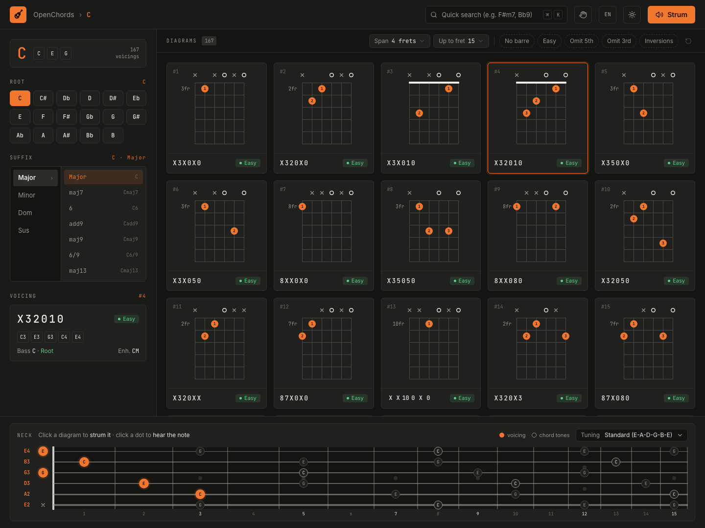

# OpenChords

> Every way to play a chord on guitar or bass, in any tuning. See the diagrams, hear each voicing, and pick the one that fits your hand best.

**Try it:** https://israelfsilva.github.io/openchords/

Inspired by the classic "Billion Chords".



---

## 🎸 Features

- **Find any chord:** pick a root and a suffix (major, minor, dominant, sus…) or type it into the search (`F#m7`, `Bb9`, `Cadd9`). Shortcut: ⌘K / Ctrl+K.
- **See every voicing:** each shape is shown as a diagram with suggested fingering, barre, open and muted strings, tab notation (`X32010`) and a difficulty rating (Easy, Medium, Hard).
- **Hear it before you play it:** click a diagram to hear the chord strummed, or click a dot to hear just that note.
- **See the whole fretboard:** the neck shows the selected voicing and where every chord tone sits, up to the fret you choose.
- **Play in your tuning:** Standard, Drop D, DADGAD, Open G, Open D, 4-string bass, or a custom tuning, string by string.
- **Filter by what your hand can reach:** max fret span, highest fret to search, no barre, easy chords only, omit the 3rd or 5th, and allow inversions.
- **Left-handed mode**, **light/dark theme**, and an interface in **English, Portuguese, and Spanish** (picked from your browser language, switchable in the header).

## ⚙️ How it works

Chords don't come from a lookup table: the app computes, right in the browser, every fret combination that forms the chord in the selected tuning. It then discards the ones a hand can't reach, suggests which fingers to use, and sorts the voicings from easiest to hardest. That's why it works with any tuning, with no server.

---

## 🛠️ Tech stack

- **Framework:** React 19 + TypeScript + Vite
- **Styling:** Tailwind CSS v4 + Inter + JetBrains Mono
- **State management:** Zustand with an LRU cache
- **Music theory:** `@tonaljs/tonal`
- **Web audio:** `Tone.js` (acoustic PolySynth with a percussive envelope)
- **Testing (TDD):** Vitest + Testing Library + jsdom

---

## 📦 Scripts

```bash
# Start the dev server
npm run dev

# Run the full test suite
npm run test:run

# Run tests in watch mode
npm run test

# Build for production
npm run build
```

## 📄 License

[MIT](LICENSE) © 2026 Israel Silva
